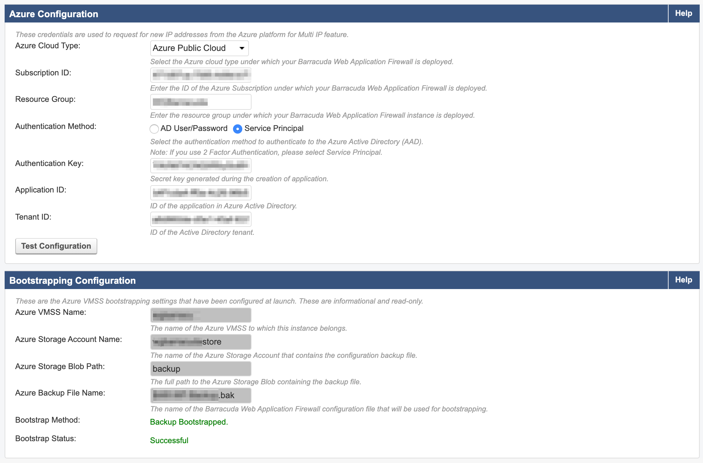

# Barracuda CloudGen WAF, on Azure

The readme explains some key areas to be considered when deploying the Barracuda CloudGen WAF, particularly from the template ```barracuda-waf_vmss.json```.

## Considerations

1. This template deploys PAYG licensed version of Barracuda CloudGen WAF
2. You will need to decide how you would like to provision the configuration of your WAF.  Your options are as follows:
  + ```NO_BOOTSTRAPING``` - in which case the appliance will be deployed but no configuration will be applied e.g. WAF rules, etc
  + ```BASIC_SERVICE_BOOTSTRAP``` - this configures a Basic Service on the WAF - no doubt, you will have additional configuration to follow, once deployed
  + ```BACKUP_BASED_BOOTSTRAP``` - (default within the template) deploy your WAF based on the configuration of a backup file.  If using this method, take a Backup from a device with the same configuration you intend to provision.  Note: when deploying via this method, settings do not retain time and region settings.


3. This template contains default parameters.  It's highly recommended that you create your own parameters file giving context to all settings defined within the WAF.
4. The variable ```userData``` is used to define all data required for: connecting to Azure - used for scaling, load-balancer configuration, etc; defining the location of the backup file - if Backup ```BACKUP_BASED_BOOTSTRAP``` method is being used; some user info; and, more.  If deploying instances of this VMSS across multiple environments, you'll need to plan your ARM template structure accordingly.

## Components of the WAF 

As mentioned, the WAF in this instance is built within a Virtual Machine Scale Set (VMSS).  This allows for scaling to meet demand on a schedule or performance metric.  It also provides a level of redundancy, particularly, if updates are required.

The WAF is fronted by an Azure Load Balanancer (ALB - Basic SKU) which is configured by the WAF itself, hence the Azure configuration mentioned above.  As the Barracuda Cluster increases nodes, as a result of the VMSS scaling-out, the WAF updates the ALB with approriate routing, etc.  However, you should review this configuration within the template prior to the intitial deployment.

As you would imagine, the ALB, has a Public IP (Basic SKU) attached.

Where the WAF is deployed via ```BACKUP_BASED_BOOTSTRAP```, a storage account is required.

## How the cluster works

The first node within the VMSS, node 0, is designated as ```Master```.  Every node, thereafter, added to the configuration of the cluster defined within the template, is a ```Peer```.  Therefore, it is recommended that you enable inbound NAT configuration in order to access to the MGMT interface of the ```Master```, apply your configuration updates or changes - these changes, in turn, will automatically synchronise to the peers - providing configuration for the cluster have been defined within the template.


### Gotchas

If you experience any issues with changes being updated to the peer, you can:
+ intiate a fresh sync from the master node - using the ```Synchonize Configuration``` tab; or,
+ as a last resort, you can scale-in your VMSS, and back out again.


### Applying Updates

Firmware updates are straightforward to apply.  These can be managed from within the interface on each node.

As with VMSS images, and image updates - or even vertical scaling (Scale-Up or Scale-Down) activity - will only take effect by applying update from within the Azure portal.  Unfortunately, this means that the WAF Cluser between the master and peers breaks-down.  Therefore, I suggest the following process to ensure that updates can be actioned without taking your services offline:

1. Ensure the VMSS has at least two instances.
1. On the ALB, remove/disable the configuration passing traffic to the master node - ensuring that all traffic is passed to the peer(s)
1. Update the master node instance from within the Azure portal
1. Bring the master node back in to operation by adding/enabling the configuration within the ALB
1. Scale-in the VMSS to one instance, and when completed,
1. Scale-out to your desired number of instances.  Each of the peers will establish themselves within the WAF cluser, register with the ALB, and have configuration syncd by the master.


## Take Care
 
 1. Highly recommend testing the process for applying updates prior to Go-Live and the first run when in Production.
 1. Once deployed, subsequent depoyments via ARM template should be caustiously considered.  Again, test this and become familiar with the behaviour.
 1. Remember, the Bootstrapping process is at deployment stage via the ARM template.  Therefore, when scaling nodes, ensure that the cluster status is healthy so that Service configuration has been synchronised - failure to do this will result in traffic being NAT'ed by the ALB to a node that is sterile.
